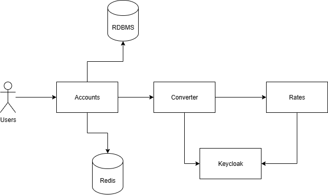

# Banking service

Данная система предоставляет функции для управления счетами банковских клиентов.

---

## Возможности

Система предоставляется следующие функции:

- Взаимодействие с клиентами через REST API.
- Создание аккаунтов клиентов.
- Создание и просмотр счетов у клиента для определенной валюты.
- Пополнение счета.
- Перевод средств между счетами одного клиента и между счетами клиентов с конвертацией валюты.

## Архитектура

Данная система имеет микросервисную архитектуру и состоит из следующих сервисов:

- Сервис __accounts__ выполняет запросы по обработке счетов и аккаунтов клиентов.
- Сервис __converter__ выполняет конвертацию валюты по запросам от _accounts_, которые осуществяются по gRPC.
- Сервис __rates__ выдает актуальный курс валют для _converter_ по REST API.
- Сервис __keycloak__ авторизует запросы от _converter_ к _rates_.
- __RDBMS__ хранит данные о клиентах.
- __Redis__ выполняет функцию поддержания идемпотентности запросов изменения счетов клиентов.

